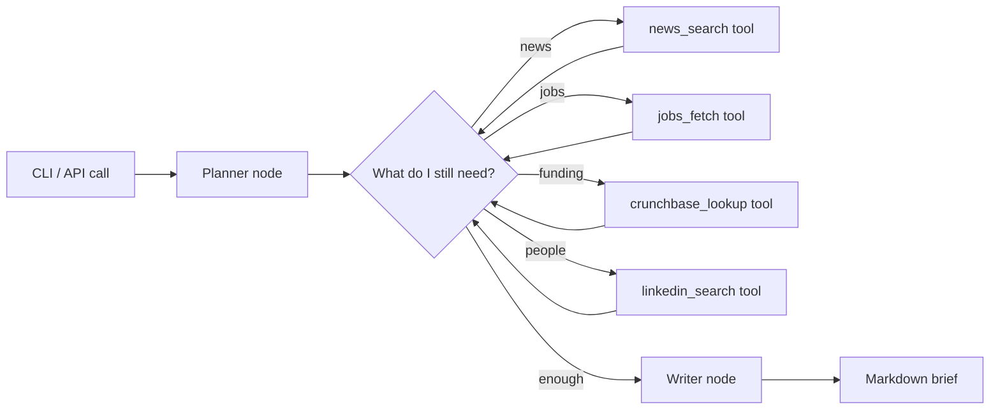

# meeting-prep-agent

A pre-call research agent for B2B sales reps. Give it a company domain and the prospect's name; get back a one-page brief with recent news, funding history, recent product launches, key people, competitive context, and three suggested talk tracks. The agent uses Claude with tool use to fetch and reason over public sources, and it stops when the brief is good enough — it doesn't make up sources to fill space.

## The GTM problem this solves

Thirty minutes before every demo, a rep does the same fifteen Google searches in a different order and copy-pastes the results into a Notion doc. The brief that results is the same shape every time. This agent does that prep deterministically, in 60 seconds, and produces a markdown brief that's actually formatted for skimming on a phone before the call.

## Quick start

```bash
pip install -r requirements.txt
export ANTHROPIC_API_KEY=sk-...
python -m meetingprep.cli prep --domain notion.so --prospect "Sara Patel"
```

Sample output (truncated):

```markdown
# Notion · Sara Patel · prep brief

## TL;DR
Notion is in an aggressive enterprise expansion phase post their AI launch. Sara, recently promoted from Senior Manager to Director, is building out a new RevOps function. She's likely buying tooling, not maintaining it.

## Recent signals
- 2026-04-02 — Launched Notion Calendar AI scheduling (TechCrunch)
- 2026-03-18 — Posted job: "Sales Engineer" (their first SE hire)
...
```

## Architecture



See `docs/ADR-001-langgraph-vs-raw-orchestration.md` for the design discussion behind picking LangGraph over a hand-rolled state machine.

## Tools the agent has

| Tool | Purpose |
|---|---|
| `news_search` | Recent news headlines for a company |
| `jobs_fetch` | Open roles from the company's careers page |
| `funding_lookup` | Last funding round and valuation |
| `people_lookup` | Title, tenure, recent moves for a person |
| `competitor_compare` | Two-sentence framing vs each known competitor |

All tools are mocked by default so the repo runs end-to-end without API keys. The mock responses are based on real public companies so the output looks like the real thing.

## Layout

```
src/meetingprep/
  agent.py        LangGraph state graph: planner -> tools -> writer
  tools.py        Tool definitions + mock implementations
  writer.py       Markdown brief template
  cli.py
docs/
  ADR-001-langgraph-vs-raw-orchestration.md
tests/
```

MIT.
